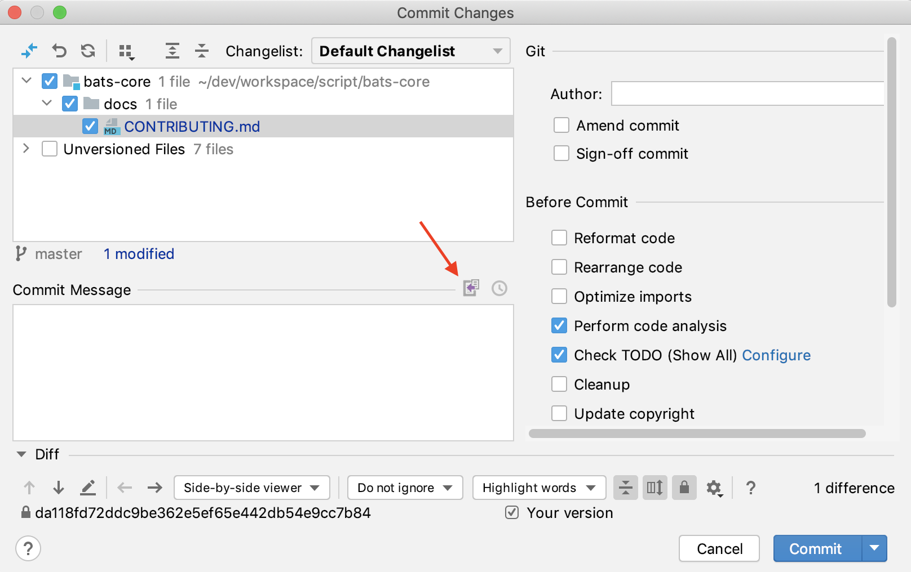
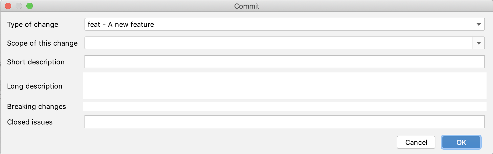

# How to contribute

## Welcome!
:+1::tada: First off, thanks for taking the time to contribute! :tada::+1:

## Code of Conduct

This project and everyone participating in it is governed by the [Code of Conduct](CODE_OF_CONDUCT.md). By participating, you are expected to uphold this code.

## Submit an issue

For bug report or enhancement suggestion, you can submit a  [GitHub issue](https://guides.github.com/features/issues/). 

Before propose a feature, a good understanding of the requested feature may be crucial for the acceptance of the proposal.

Firstly, search if your idea is not already created by others, then fill the information on the [issues page](https://github.com/renault-digital/bash-base/issues/new/choose).

## Code Contribution

If you want, aside from submitting a github issue, a good pull request is a fantastic help.

A pull request should remain focused in scope and avoid containing unrelated commits.

#### Understand the technology stack

- Works with git, npm and docker

- Bash best practices
    - Audit shell script with [shellcheck](https://www.shellcheck.net/)
    - Format shell script with [shfmt](https://github.com/mvdan/sh)
    
- BDD
    - BDD test with [ShellSpec](https://shellspec.info)
    - Code coverage with [Kcov](http://simonkagstrom.github.io/kcov/index.html) and [codecov](https://codecov.io)
    - 100% coverage

- Respect [Semantic Versioning 2.0.0](https://semver.org/) and [Conventional Commits 1.0.0](https://www.conventionalcommits.org/en/v1.0.0/)
    - Help input commit message 
        - CLI: with [Husky](https://github.com/typicode/husky) and [Commitizen](http://commitizen.github.io/cz-cli)
        - IntelliJ IDEA: plugin [Git Commit Template](https://plugins.jetbrains.com/plugin/9861-git-commit-template)
    - Audit commit message with [Commitlint](https://commitlint.js.org) for CI/CD pipeline, local lint and git hook `commit-msg`
    
- LiveDoc:
    - The comment of functions respect the [man page](https://en.wikipedia.org/wiki/Man_page) standards and conventions and use the 5 basic sections (NAME, SYNOPSIS, DESCRIPTION, EXAMPLES, SEE ALSO) 
    - Format and audit the comment by bash-base function `doc_lint_script_comment`
    - Generate docs/references.md from function comments by bash-base function `doc_comment_to_markdown`
    - Generate man page bash-base.1 from docs/references.md by [pandoc](https://pandoc.org)
    
- Automatically release a new version with [semantic release](https://semantic-release.gitbook.io/) if need:
    - Analyser the commit message to decide the new version
    - Generate release note
    - Generate&Update CHANGELOG.md
    - Generate&Update bin/bash-base.sh from src/*.sh
    - Build docker image
    - Lint man-styled script comment
    - Generate docs/references.md and man/bash-base.1
    - Tag and Release on Github
    - Push new release to [npm Registry](https://www.npmjs.com)
    - Push new release to [docker hub](https://hub.docker.com)
    
- CICD Workflow config with [NPM](https://docs.npmjs.com/about-npm/) and [Github actions](https://docs.github.com/en/actions)
    

#### Notes

- in commit message template, the default issuePrefixes: `['#']`

- in CLI (not intelliJ plugin), when do a `git commit`, `git merge`, `git rebase` or other operation, even we explicitly provide commit message, the `prepare-commit-msg` hook will still be revoked and the `commitizen` will show the prompts. We can just press `Ctrl + C` to skip it and it comes to `commit-msg` hook.

- Don't modify the files `bin/`, `man/` and `docs/references.md`, they will generated automatically by semantic-release.


#### How to do it ?

1. Submit an issue, get the issue number, and assign it to you.

1. Clone the repository branch `master`. If you clone a while ago, get the latest changes from upstream.

1. Create your branch:

    ```
    git checkout -b <your-branch-name>
    ```
   
1. Setup dev environement

    ```
    npm ci
    ```

1. Modify the code. Remember to write / update the tests for the proposed evolution, 100% test coverage is required, as every function will be used by users, we need to ensure its accuracy.

1. Commit your changes in logical chunks. Please see the [commit message guidelines](https://github.com/angular/angular.js/blob/master/DEVELOPERS.md#-git-commit-guidelines).

    ```
    git commit
    ```
    Fill the info (including the issue number) for each step of wizard.
    
    If you prefer IntelliJ IDEA, the plugin [Git Commit Template](https://plugins.jetbrains.com/plugin/9861-git-commit-template) is proposed.
    
    
    
    
    
1. Push your changes and the hook will verify the result in local:
                                       
   ```
   npm test
   npm run lint
   # npm run lint:commit
   # npm run test:coverage # to be sure coverage 100%
   ```
    
1. Open a pull request with a clear title and description in template
